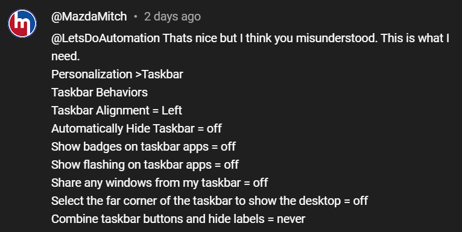

# PowerShell: Creating viewer requested script 01

<b>Request:</b>



<b>Actions performed by powershell script:</b>

* Get current registry entry value for "Automatically hide taskbar"
  * Modify the bit that is responsible for "Automatically hide taskbar"
* Create provisioning folder in C:\ProgramData\ directory
* Create user-settings.reg registry file with taskbar configuration in C:\ProgramData\provisioning directory
* Configure ActiveSetup to import user-settings.reg file for users that will sign-in to the computer

<b>Snippet for modifying taskbar settings:</b>

```powershell
$get_stuck_rects3_settings = @{
    Path = "HKCU:\SOFTWARE\Microsoft\Windows\CurrentVersion\Explorer\StuckRects3"
    Name = "Settings"
}

$stuck_rects3 = Get-ItemProperty @get_stuck_rects3_settings

$stuck_rects3.settings[8] = 2

[IO.DirectoryInfo]$provisioning = "$($env:PROGRAMDATA)\provisioning"

if(!$provisioning.Exists){
    $provisioning.Create()
}

@"
Windows Registry Editor Version 5.00

[HKEY_CURRENT_USER\Software\Microsoft\Windows\CurrentVersion\Explorer\Advanced]
"TaskbarAl"=dword:00000000
"TaskbarGlomLevel"=dword:00000002
"TaskbarBadges"=dword:00000000
"TaskbarFlashing"=dword:00000000
"TaskbarSn"=dword:00000000
"TaskbarSd"=dword:00000000

[HKEY_CURRENT_USER\Software\Microsoft\Windows\CurrentVersion\Explorer\StuckRects3]
"Settings"=hex:{0}
  
"@ -f (($stuck_rects3.settings | %{'{0:X2}' -f $_ }) -join ',') | Out-File "$($provisioning.FullName)\user-settings.reg" -Encoding unicode -Force

$configure_active_setup = @{
    Path        = "HKLM:\SOFTWARE\Microsoft\Active Setup\Installed Components\UserSettings"
    ErrorAction = "SilentlyContinue"
}

$configure_runonce = @{
    Name  = "StubPath"
    Value = 'REG IMPORT "{0}"' -f "$($provisioning.FullName)\user-settings.reg"
}

ni @configure_active_setup | New-ItemProperty @configure_runonce
```

## Related videos

<b>Other powershell videos:</b>

[PowerShell playlist](https://www.youtube.com/playlist?list=PLVncjTDMNQ4RDyVzbV0_kpXCScTMgUw_A)
[Windows Registry](https://www.youtube.com/playlist?list=PLVncjTDMNQ4TZrwwuYuZBZhpjs6YWw7sQ)