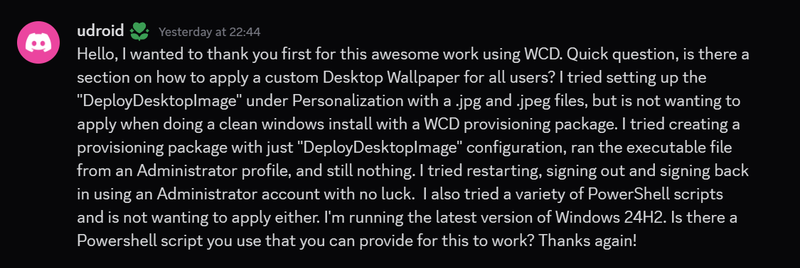

# PowerShell: Creating viewer requested script 02

<b>Request:</b>



<b>Snippet for configuring wallpaper settings:</b>

```powershell
$settings =
[PSCustomObject]@{
    Path  = "SOFTWARE\Microsoft\Windows\CurrentVersion\PersonalizationCSP"
    Name  = "DesktopImageStatus"
    Value = 1
},
[PSCustomObject]@{
    Path  = "SOFTWARE\Microsoft\Windows\CurrentVersion\PersonalizationCSP"
    Name  = "DesktopImagePath"
    Value = "C:\wallpaper.png"
}

foreach ($setting in ($settings | group Path)) {
    $registry = [Microsoft.Win32.Registry]::LocalMachine.OpenSubKey($setting.Name, $true)
    if ($null -eq $registry) {
        $registry = [Microsoft.Win32.Registry]::LocalMachine.CreateSubKey($setting.Name, $true)
    }
    $setting.Group | % {
        $registry.SetValue($_.name, $_.value)
    }
    $registry.Dispose()
}
```

## Related videos

<b>Other powershell videos:</b>

* [PowerShell playlist](https://www.youtube.com/playlist?list=PLVncjTDMNQ4RDyVzbV0_kpXCScTMgUw_A)
* [Windows Registry](https://www.youtube.com/playlist?list=PLVncjTDMNQ4TZrwwuYuZBZhpjs6YWw7sQ)