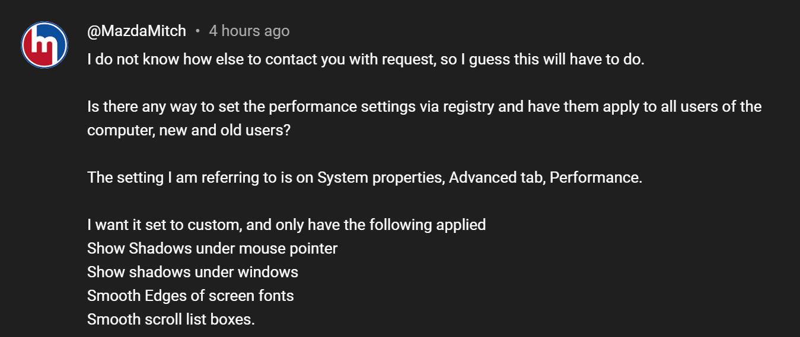

# PowerShell: Creating viewer requested script 01

<b>Request:</b>



<b>Snippet for modifying Windows performance settings:</b>

```powershell
[IO.DirectoryInfo]$provisioning = "$($env:PROGRAMDATA)\provisioning"

if(!$provisioning.Exists){
    $provisioning.Create()
}

@"
Windows Registry Editor Version 5.00

[HKEY_CURRENT_USER\Software\Microsoft\Windows\CurrentVersion\Explorer\VisualEffects]
"VisualFXSetting"=dword:00000003

[HKEY_CURRENT_USER\Software\Microsoft\Windows\CurrentVersion\Explorer\Advanced]
"IconsOnly"=dword:00000001
"ListviewAlphaSelect"=dword:00000000
"ListviewShadow"=dword:00000000
"TaskbarAnimations"=dword:00000000

[HKEY_CURRENT_USER\Control Panel\Desktop]
"UserPreferencesMask"=hex:98,32,07,80,10,00,00,00
"DragFullWindows"="0"

[HKEY_CURRENT_USER\Control Panel\Desktop\WindowMetrics]
"MinAnimate"="0"

[HKEY_CURRENT_USER\Software\Microsoft\Windows\DWM]
"EnableAeroPeek"=dword:00000000

"@ | Out-File "$($provisioning.FullName)\user-settings.reg" -Encoding unicode -Force

$configure_active_setup = @{
    Path        = "HKLM:\SOFTWARE\Microsoft\Active Setup\Installed Components\UserSettings"
    ErrorAction = "SilentlyContinue"
}

$configure_runonce = @{
    Name  = "StubPath"
    Value = 'REG ADD "HKCU\SOFTWARE\Microsoft\Windows\CurrentVersion\RunOnce" /v ImportUserRegistry /d "REG IMPORT {0}" /f' -f "$($provisioning.FullName)\user-settings.reg"
}

ni @configure_active_setup | New-ItemProperty @configure_runonce
```

## Related videos

<b>Other powershell videos:</b>

* [PowerShell playlist](https://www.youtube.com/playlist?list=PLVncjTDMNQ4RDyVzbV0_kpXCScTMgUw_A)
* [Windows Registry](https://www.youtube.com/playlist?list=PLVncjTDMNQ4TZrwwuYuZBZhpjs6YWw7sQ)