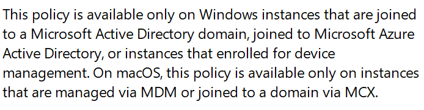

# PowerShell: Set Microsoft Edge Home, New Tab Page and Home Button

<b>Objectives:</b>

* Set Microsoft Edge Home, New Tab Page and Home Button

<b>Notes:</b> Works for Windows Pro and Enterprise <br />



<b>PowerShell snippet:</b>

```powershell
$settings = 
[PSCustomObject]@{ 
    Path  = "SOFTWARE\Policies\Microsoft\Edge"
    Value = "https://duckduckgo.com"
    Name  = "HomepageLocation" # set homepage
},
[PSCustomObject]@{
    Path  = "SOFTWARE\Policies\Microsoft\Edge"
    Value = "https://google.com/"
    Name  = "NewTabPageLocation" # set new page
},
[PSCustomObject]@{
    Path  = "SOFTWARE\Policies\Microsoft\Edge"
    Value = 0 # 1 - Enable, 2 - Disable
    Name  = "HomepageIsNewTabPage" # home page same as new page
},
[PSCustomObject]@{
    Path  = "SOFTWARE\Policies\Microsoft\Edge"
    Value = 1 # 1 - Enable, 2 - Disable
    Name  = "ShowHomeButton" # Show home button
} | group Path

foreach($setting in $settings){
    $registry = [Microsoft.Win32.Registry]::LocalMachine.OpenSubKey($setting.Name, $true)
    if ($null -eq $registry) {
        $registry = [Microsoft.Win32.Registry]::LocalMachine.CreateSubKey($setting.Name, $true)
    }
    $setting.Group | %{
        $registry.SetValue($_.name, $_.value)
    }
    $registry.Dispose()
}
```