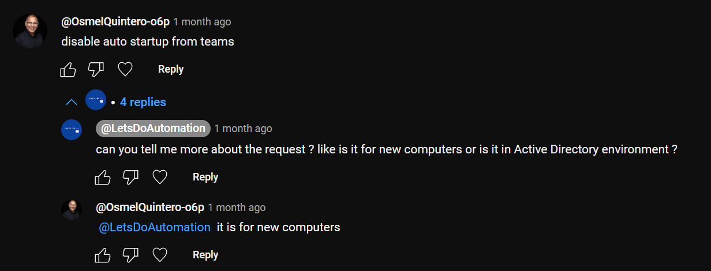

# PowerShell: Stop Teams from running on startup in Windows 11

<b>Request:</b>



<b>Notes:</b>

* Works for Microsoft Teams(new)
* Works only for users that have autorun enabled during script execution

<b>Registry entry location:</b>

```batch
HKEY_CURRENT_USER\Software\Classes\Local Settings\Software\Microsoft\Windows\CurrentVersion\AppModel\SystemAppData\MSTeams_8wekyb3d8bbwe\TeamsTfwStartupTask
```

<b>Disable startup for single user:</b>

```powershell
Get-ItemProperty "HKCU:\Software\Classes\Local Settings\Software\Microsoft\Windows\CurrentVersion\AppModel\SystemAppData\MSTeams*\TeamsTfwStartupTask" | Set-ItemProperty -Name state -Value 1
```

<b>Disable startup for multiple user:</b>

```powershell
[System.IO.DirectoryInfo]$provisioning = "$($env:ProgramData)\provisioning"

if (!$provisioning.Exists) {
    $provisioning.Create()
}

@"
Windows Registry Editor Version 5.00

[HKEY_CURRENT_USER\Software\Classes\Local Settings\Software\Microsoft\Windows\CurrentVersion\AppModel\SystemAppData\MSTeams_8wekyb3d8bbwe\TeamsTfwStartupTask]
"State"=dword:00000001
"@ | Out-File "$($provisioning.FullName)\DisableTeamsAutoStart.reg" -Encoding unicode

$registry_settings =
[PSCustomObject]@{ # Import DisableTeamsAutoStart using ActiveSetup
    Path  = "SOFTWARE\Microsoft\Active Setup\Installed Components\ImportUserRegistry"
    Name  = "StubPath"
    Value = 'REG ADD "HKCU\SOFTWARE\Microsoft\Windows\CurrentVersion\RunOnce" /v ImportUserRegistry /d "REG IMPORT {0}" /f' -f "$($provisioning.FullName)\DisableTeamsAutoStart.reg"
}

foreach ($setting in ($registry_settings | group Path)) {
    $registry = [Microsoft.Win32.Registry]::LocalMachine.OpenSubKey($setting.Name, $true)
    if ($null -eq $registry) {
        $registry = [Microsoft.Win32.Registry]::LocalMachine.CreateSubKey($setting.Name, $true)
    }
    $setting.Group | % {
        if (!$_.Type) {
            $registry.SetValue($_.name, $_.value)
        }
        else {
            $registry.SetValue($_.name, $_.value, $_.type)
        }
    }
    $registry.Dispose()
}
```

# Related videos

<b>PowerShell:</b>

* [PowerShell playlist](https://www.youtube.com/playlist?list=PLVncjTDMNQ4RDyVzbV0_kpXCScTMgUw_A)

<b>Reigstry:</b>

* [Windows Registry: Active Setup](https://youtu.be/HrVJ7wdvfmo)
* [Windows Registry: Run and RunOnce](https://youtu.be/zgFzCq5uEPw)