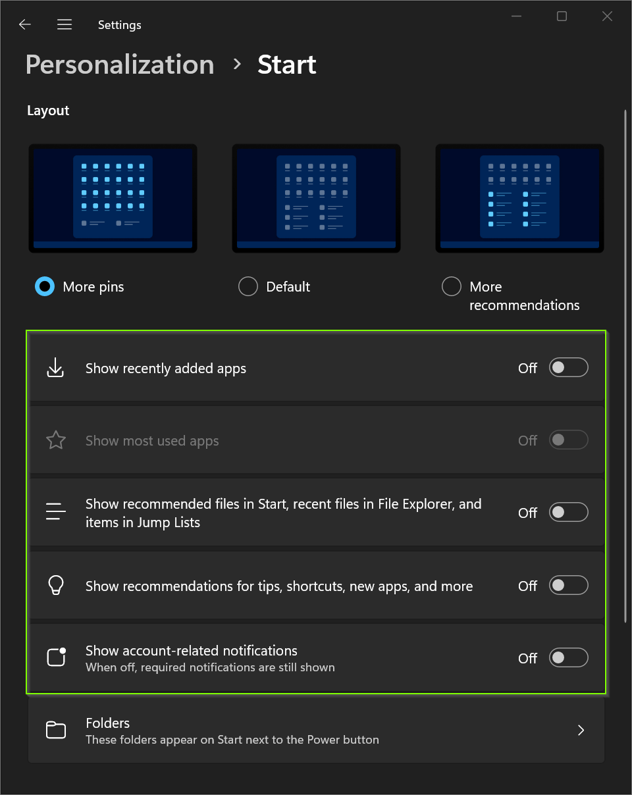

# PowerShell: Windows 11 configure Start personalizations

<b>Objectives:</b>



* Configure for current user
* Configure for all users

<b>Disable everything for current user:</b>

```powershell
$settings = 
[PSCustomObject]@{ # Show recently added apps
    Path  = "SOFTWARE\Microsoft\Windows\CurrentVersion\Start"
    Name  = "ShowRecentList"
    Value = 0 # 0 Off, 1 On
},
[PSCustomObject]@{ # Show recently added apps
    Path  = "SOFTWARE\Microsoft\Windows\CurrentVersion\Start"
    Name  = "ShowFrequentList"
    Value = 0 # 0 Off, 1 On
},
[PSCustomObject]@{ # Show recommended files in start, recent files in File Explorer and items in Jump Lists 
    Path  = "SOFTWARE\Microsoft\Windows\CurrentVersion\Explorer\Advanced"
    Name  = "Start_TrackDocs"
    Value = 0 # 0 Off, 1 On
},
[PSCustomObject]@{ # show recommendations for tips, shortcuts, new apps and more
    Path  = "SOFTWARE\Microsoft\Windows\CurrentVersion\Explorer\Advanced"
    Name  = "Start_IrisRecommendations"
    Value = 0 # 0 Off, 1 On
},
[PSCustomObject]@{ # show recommendations for tips, shortcuts, new apps and more
    Path  = "SOFTWARE\Microsoft\Windows\CurrentVersion\Explorer\Advanced"
    Name  = "Start_AccountNotifications"
    Value = 0 # 0 Off, 1 On
}

foreach ($setting in ($settings | group Path)) {
    $registry = [Microsoft.Win32.Registry]::CurrentUser.OpenSubKey($setting.Name, $true)
    if ($null -eq $registry) {
        $registry = [Microsoft.Win32.Registry]::CurrentUser.CreateSubKey($setting.Name, $true)
    }
    $setting.Group | % {
        if (!$_.Type) {
            $registry.SetValue($_.name, $_.value)
        }
        else {
            $registry.SetValue($_.name, $_.value, $_.type)
        }
    }
    $registry.Dispose()
}
```

<b>Enable everything for current user:</b>

```powershell
$settings = 
[PSCustomObject]@{ # Show recently added apps
    Path  = "SOFTWARE\Microsoft\Windows\CurrentVersion\Start"
    Name  = "ShowRecentList"
    Value = 1 # 0 Off, 1 On
},
[PSCustomObject]@{ # Show recently added apps
    Path  = "SOFTWARE\Microsoft\Windows\CurrentVersion\Start"
    Name  = "ShowFrequentList"
    Value = 1 # 0 Off, 1 On
},
[PSCustomObject]@{ # Show recommended files in start, recent files in File Explorer and items in Jump Lists 
    Path  = "SOFTWARE\Microsoft\Windows\CurrentVersion\Explorer\Advanced"
    Name  = "Start_TrackDocs"
    Value = 1 # 0 Off, 1 On
},
[PSCustomObject]@{ # show recommendations for tips, shortcuts, new apps and more
    Path  = "SOFTWARE\Microsoft\Windows\CurrentVersion\Explorer\Advanced"
    Name  = "Start_IrisRecommendations"
    Value = 1 # 0 Off, 1 On
},
[PSCustomObject]@{ # show recommendations for tips, shortcuts, new apps and more
    Path  = "SOFTWARE\Microsoft\Windows\CurrentVersion\Explorer\Advanced"
    Name  = "Start_AccountNotifications"
    Value = 1 # 0 Off, 1 On
}

foreach ($setting in ($settings | group Path)) {
    $registry = [Microsoft.Win32.Registry]::CurrentUser.OpenSubKey($setting.Name, $true)
    if ($null -eq $registry) {
        $registry = [Microsoft.Win32.Registry]::CurrentUser.CreateSubKey($setting.Name, $true)
    }
    $setting.Group | % {
        if (!$_.Type) {
            $registry.SetValue($_.name, $_.value)
        }
        else {
            $registry.SetValue($_.name, $_.value, $_.type)
        }
    }
    $registry.Dispose()
}
```

<b>Disable everything for all users</b>

```powershell
[System.IO.DirectoryInfo]$provisioning = "$($env:ProgramData)\provisioning"

if(!$provisioning.Exists){
    $provisioning.Create()
}

@"
Windows Registry Editor Version 5.00

[HKEY_CURRENT_USER\SOFTWARE\Microsoft\Windows\CurrentVersion\Start]
"ShowRecentList"=dword:00000000
"ShowFrequentList"=dword:00000000

[HKEY_CURRENT_USER\SOFTWARE\Microsoft\Windows\CurrentVersion\Explorer\Advanced]
"Start_TrackDocs"=dword:00000000
"Start_IrisRecommendations"=dword:00000000
"Start_AccountNotifications"=dword:00000000
"@ | Out-File "$($provisioning.FullName)\user_settings_registry.reg" -Encoding unicode -Force

$settings = 
[PSCustomObject]@{ # Configure ActiveSetup to import registry file
    Path  = "SOFTWARE\Microsoft\Active Setup\Installed Components\ImportUserRegistry"
    Name  = "StubPath"
    Value = 'REG ADD "HKCU\SOFTWARE\Microsoft\Windows\CurrentVersion\RunOnce" /v ImportUserRegistry /d "REG IMPORT {0}" /f' -f "$($provisioning.FullName)\user_settings_registry.reg"
}

foreach ($setting in ($settings | group Path)) {
    $registry = [Microsoft.Win32.Registry]::LocalMachine.OpenSubKey($setting.Name, $true)
    if ($null -eq $registry) {
        $registry = [Microsoft.Win32.Registry]::LocalMachine.CreateSubKey($setting.Name, $true)
    }
    $setting.Group | % {
        if (!$_.Type) {
            $registry.SetValue($_.name, $_.value)
        }
        else {
            $registry.SetValue($_.name, $_.value, $_.type)
        }
    }
    $registry.Dispose()
}
```

# More PowerShell snippet videos:

[PowerShell](https://www.youtube.com/playlist?list=PLVncjTDMNQ4RDyVzbV0_kpXCScTMgUw_A)