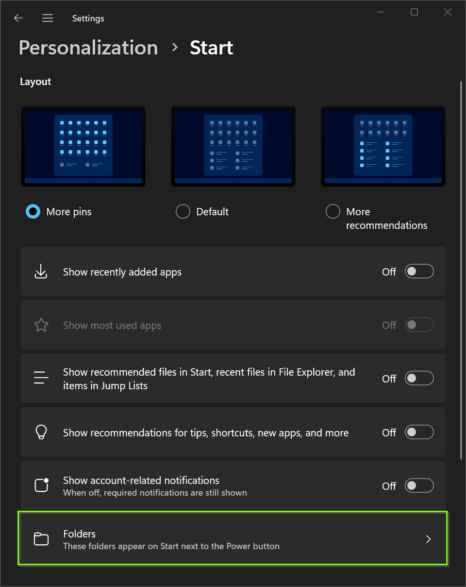

# PowerShell: Windows 11 configure start menu folder icons

<b>Objectives:</b>



<b>Apply start menu folder configuration:</b>

```powershell
$settings =
[PSCustomObject]@{ # Start enable documents
    Path  = "SOFTWARE\Microsoft\PolicyManager\current\device\Start"
    Name  = "AllowPinnedFolderDocuments"
    Value = 1
},
[PSCustomObject]@{ # Start enable documents
    Path  = "SOFTWARE\Microsoft\PolicyManager\current\device\Start"
    Name  = "AllowPinnedFolderDocuments_ProviderSet"
    Value = 1
},
[PSCustomObject]@{ # Start enable downloads
    Path  = "SOFTWARE\Microsoft\PolicyManager\current\device\Start"
    Name  = "AllowPinnedFolderDownloads"
    Value = 1
},
[PSCustomObject]@{ # Start enable downloads
    Path  = "SOFTWARE\Microsoft\PolicyManager\current\device\Start"
    Name  = "AllowPinnedFolderDownloads_ProviderSet"
    Value = 1
},
[PSCustomObject]@{ # Start enable file explorer
    Path  = "SOFTWARE\Microsoft\PolicyManager\current\device\Start"
    Name  = "AllowPinnedFolderFileExplorer"
    Value = 1
},
[PSCustomObject]@{ # Start enable file explorer
    Path  = "SOFTWARE\Microsoft\PolicyManager\current\device\Start"
    Name  = "AllowPinnedFolderFileExplorer_ProviderSet"
    Value = 1
},
[PSCustomObject]@{ # Start enable music folder
    Path  = "SOFTWARE\Microsoft\PolicyManager\current\device\Start"
    Name  = "AllowPinnedFolderMusic"
    Value = 1
},
[PSCustomObject]@{ # Start enable music folder
    Path  = "SOFTWARE\Microsoft\PolicyManager\current\device\Start"
    Name  = "AllowPinnedFolderMusic_ProviderSet"
    Value = 1
},
[PSCustomObject]@{ # Start enable personal folder
    Path  = "SOFTWARE\Microsoft\PolicyManager\current\device\Start"
    Name  = "AllowPinnedFolderPersonalFolder"
    Value = 1
},
[PSCustomObject]@{ # Start enable personal folder
    Path  = "SOFTWARE\Microsoft\PolicyManager\current\device\Start"
    Name  = "AllowPinnedFolderPersonalFolder_ProviderSet"
    Value = 1
},
[PSCustomObject]@{ # Start enable pictures
    Path  = "SOFTWARE\Microsoft\PolicyManager\current\device\Start"
    Name  = "AllowPinnedFolderPictures"
    Value = 1
},
[PSCustomObject]@{ # Start enable pictures
    Path  = "SOFTWARE\Microsoft\PolicyManager\current\device\Start"
    Name  = "AllowPinnedFolderPictures_ProviderSet"
    Value = 1
},
[PSCustomObject]@{ # Start enable settings
    Path  = "SOFTWARE\Microsoft\PolicyManager\current\device\Start"
    Name  = "AllowPinnedFolderSettings"
    Value = 1
},
[PSCustomObject]@{ # Start enable settings
    Path  = "SOFTWARE\Microsoft\PolicyManager\current\device\Start"
    Name  = "AllowPinnedFolderSettings_ProviderSet"
    Value = 1
},
[PSCustomObject]@{ # Start enable videos
    Path  = "SOFTWARE\Microsoft\PolicyManager\current\device\Start"
    Name  = "AllowPinnedFolderVideos"
    Value = 1
},
[PSCustomObject]@{ # Start enable videos
    Path  = "SOFTWARE\Microsoft\PolicyManager\current\device\Start"
    Name  = "AllowPinnedFolderVideos_ProviderSet"
    Value = 1
},
[PSCustomObject]@{ # Start enable network
    Path  = "SOFTWARE\Microsoft\PolicyManager\current\device\Start"
    Value = 1
    Name  = "AllowPinnedFolderNetwork"
},
[PSCustomObject]@{ # Start enable network
    Path  = "SOFTWARE\Microsoft\PolicyManager\current\device\Start"
    Name  = "AllowPinnedFolderNetwork_ProviderSet"
    Value = 1
}

foreach ($setting in ($settings | group Path)) {
    $registry = [Microsoft.Win32.Registry]::LocalMachine.OpenSubKey($setting.Name, $true)
    if ($null -eq $registry) {
        $registry = [Microsoft.Win32.Registry]::LocalMachine.CreateSubKey($setting.Name, $true)
    }
    $setting.Group | % {
        if (!$_.Type) {
            $registry.SetValue($_.name, $_.value)
        }
        else {
            $registry.SetValue($_.name, $_.value, $_.type)
        }
    }
    $registry.Dispose()
}
```

<b>Remove start menu folder configuration:</b>

```powershell
$settings = 
[PSCustomObject]@{ # Documents
    Path  = "SOFTWARE\Microsoft\PolicyManager\current\device\Start"
    Name  = "AllowPinnedFolderDocuments"
},
[PSCustomObject]@{ # Documents
    Path  = "SOFTWARE\Microsoft\PolicyManager\current\device\Start"
    Name  = "AllowPinnedFolderDocuments_ProviderSet"
},
[PSCustomObject]@{ # Downloads
    Path  = "SOFTWARE\Microsoft\PolicyManager\current\device\Start"
    Name  = "AllowPinnedFolderDownloads"
},
[PSCustomObject]@{ # Downloads
    Path  = "SOFTWARE\Microsoft\PolicyManager\current\device\Start"
    Name  = "AllowPinnedFolderDownloads_ProviderSet"
},
[PSCustomObject]@{ # File explorer
    Path  = "SOFTWARE\Microsoft\PolicyManager\current\device\Start"
    Name  = "AllowPinnedFolderFileExplorer"
},
[PSCustomObject]@{ # File explorer
    Path  = "SOFTWARE\Microsoft\PolicyManager\current\device\Start"
    Name  = "AllowPinnedFolderFileExplorer_ProviderSet"
},
[PSCustomObject]@{ # Music folder
    Path  = "SOFTWARE\Microsoft\PolicyManager\current\device\Start"
    Name  = "AllowPinnedFolderMusic"
},
[PSCustomObject]@{ # Music folder
    Path  = "SOFTWARE\Microsoft\PolicyManager\current\device\Start"
    Name  = "AllowPinnedFolderMusic_ProviderSet"
},
[PSCustomObject]@{ # Personal folder
    Path  = "SOFTWARE\Microsoft\PolicyManager\current\device\Start"
    Name  = "AllowPinnedFolderPersonalFolder"
},
[PSCustomObject]@{ # Personal folder
    Path  = "SOFTWARE\Microsoft\PolicyManager\current\device\Start"
    Name  = "AllowPinnedFolderPersonalFolder_ProviderSet"
},
[PSCustomObject]@{ # Pictures
    Path  = "SOFTWARE\Microsoft\PolicyManager\current\device\Start"
    Name  = "AllowPinnedFolderPictures"
},
[PSCustomObject]@{ # Pictures
    Path  = "SOFTWARE\Microsoft\PolicyManager\current\device\Start"
    Name  = "AllowPinnedFolderPictures_ProviderSet"
},
[PSCustomObject]@{ # Settings
    Path  = "SOFTWARE\Microsoft\PolicyManager\current\device\Start"
    Name  = "AllowPinnedFolderSettings"
},
[PSCustomObject]@{ # Settings
    Path  = "SOFTWARE\Microsoft\PolicyManager\current\device\Start"
    Name  = "AllowPinnedFolderSettings_ProviderSet"
},
[PSCustomObject]@{ # Videos
    Path  = "SOFTWARE\Microsoft\PolicyManager\current\device\Start"
    Name  = "AllowPinnedFolderVideos"
},
[PSCustomObject]@{ # Videos
    Path  = "SOFTWARE\Microsoft\PolicyManager\current\device\Start"
    Name  = "AllowPinnedFolderVideos_ProviderSet"
},
[PSCustomObject]@{ # Network
    Path  = "SOFTWARE\Microsoft\PolicyManager\current\device\Start"
    Name  = "AllowPinnedFolderNetwork"
},
[PSCustomObject]@{ # Network
    Path  = "SOFTWARE\Microsoft\PolicyManager\current\device\Start"
    Name  = "AllowPinnedFolderNetwork_ProviderSet"
}

foreach($setting in ($settings | group Path)){
    $registry = [Microsoft.Win32.Registry]::LocalMachine.OpenSubKey($setting.Name, $true)
    if ($null -eq $registry) {
        continue
    }

    foreach($item in $setting.Group.Where({$null -ne $registry.GetValue($_.name)})){
        $registry.DeleteValue($item.name, $true)
    }
    $registry.Dispose()
}
```

# More PowerShell snippet videos:

[PowerShell](https://www.youtube.com/playlist?list=PLVncjTDMNQ4RDyVzbV0_kpXCScTMgUw_A)