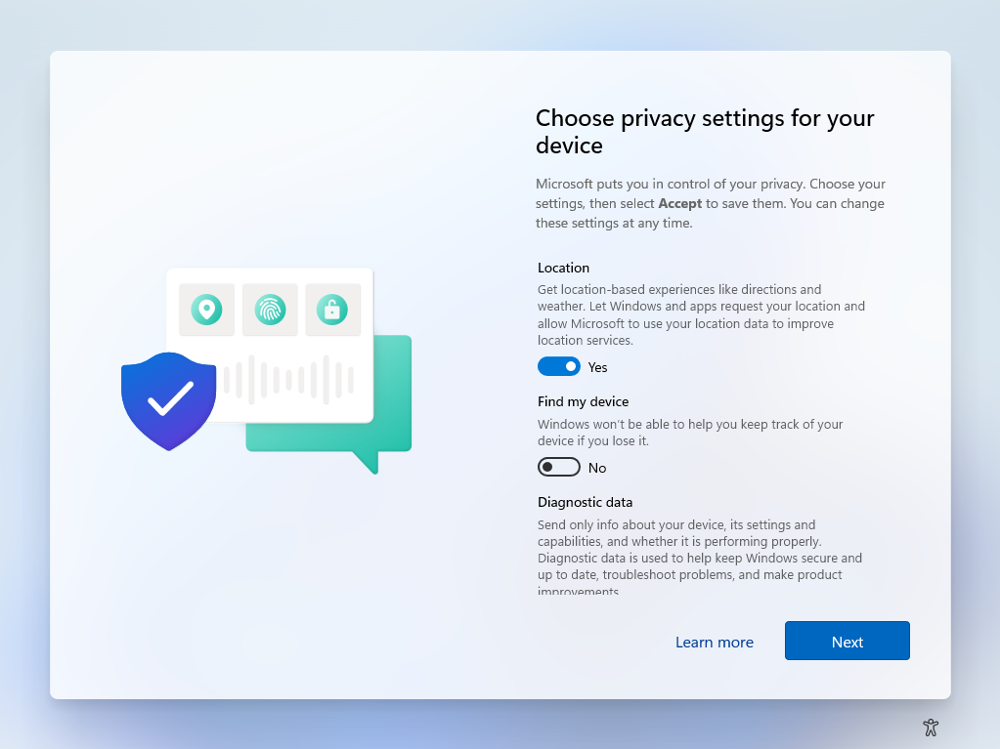

# PowerShell: Windows 11 disable privacy experience for new users

<b>Privacy experience window:</b>



```powershell
$settings =
[PSCustomObject]@{
    Path  = "SOFTWARE\Policies\Microsoft\Windows\OOBE"
    Name  = "DisablePrivacyExperience"
    Value = 1
} | group Path

foreach ($setting in $settings) {
    $registry = [Microsoft.Win32.Registry]::LocalMachine.OpenSubKey($setting.Name, $true)
    if ($null -eq $registry) {
        $registry = [Microsoft.Win32.Registry]::LocalMachine.CreateSubKey($setting.Name, $true)
    }
    $setting.Group | % {
        $registry.SetValue($_.name, $_.value)
    }
    $registry.Dispose()
}
```

## Related videos

<b>Other powershell videos</b>

[PowerShell playlist](https://www.youtube.com/playlist?list=PLVncjTDMNQ4RDyVzbV0_kpXCScTMgUw_A)